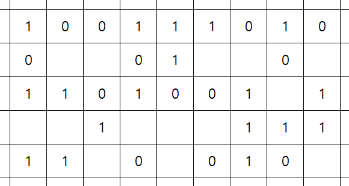
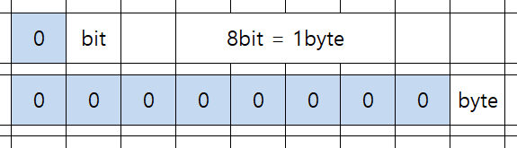
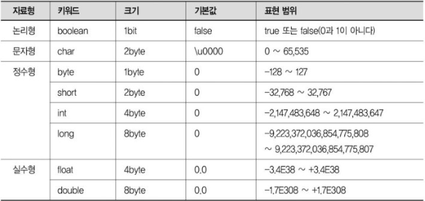
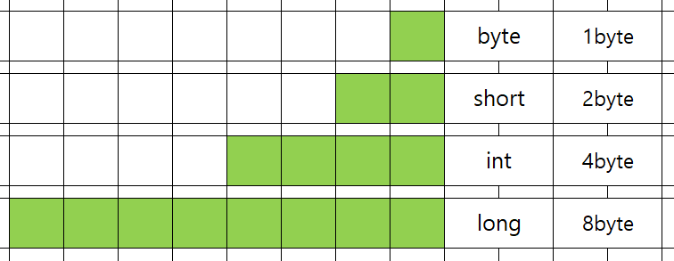
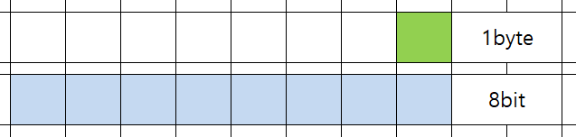
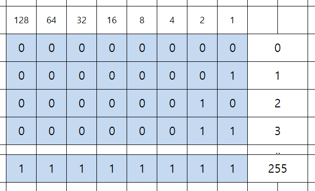
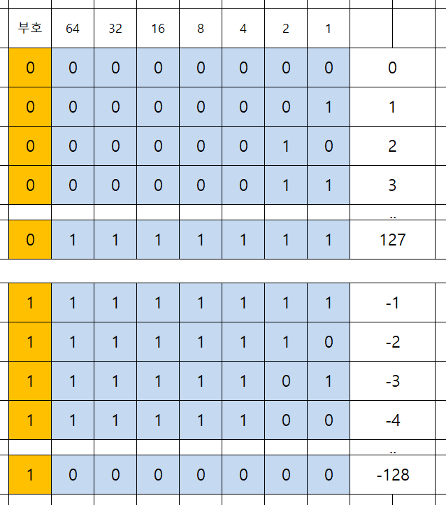

>개인 공부 후 자료를 남기기 위한 목적임으로 내용 상에 오류가 있을 수 있습니다.
  
# 자료형, Data Type
---
자료형(데이터 타입)은 컴퓨터 과학과 프로그램이 언어에서 데이터를 분류하고 식별하는 기준이다. 다음과 같은 요소들을 결정한다.
- 해당 자료형에 대한 가능한 값의 범위
- 수행 가능한 연산
- 데이터의 의미
- 값을 저장하는 방식
  

## 자료형을 나누는 기준
---
1. 형태
2. 길이
3. 저장 방식

## 메모리 구조
---
- 메모리는 다음과 같이 1과 0을 저장할 수 있는 공간들이 수많은 집합으로 구성되어 있다.
-  메모리의 가장 기본 단위는 1바이트(8비트)이다.
- 각 바이트마다 고유한 식별자(주소)가 순차적으로 할당된다.
- 주소는 0부터 시작하여 순차적으로 증가한다.
	- 32비트 시스템 : 최대 4GB(2^32개)의 주소 공간을 가진다.
	- 64비트 시스템 : 훨씬 더 큰 주소 공간을 제공한다. 
		<!--   -->
	- 1 또는 0을 저장할 수 있는 단일 공간을 bit라고 한다.
	- 8개의 연속된 bit 공간들을 byte라고 한다.
		<!--  -->

## 자바의 자료형
---
- 데이터(자료)의 형태
- 데이터의 길이(범위)와 생김새를 미리 정의하고, 그 정의에 따라 분류해놓은 규칙
	
	
### 기본형,  원시형(Primitive Type), 값형(Value Type)
- 8가지(byte, short, int, long, float, double, char, boolean)
1. 숫자형
	- 정수형
		1. byte
			- 1byte(=8bit)
			- 2^8
			- -128 ~ 127
			```java
				byte b1;
				b1 = Byte.MAX_VALUE;
				System.out.println("Byte의 최대값: " + b1);
				
				b1 = Byte.MIN_VALUE;
				System.out.println("Byte의 최소값: " + b1);
			```
			```
				Byte의 최대값: 127
				Byte의 최소값: -128
			```
		1. short
			- 2byte(16bit)
			- 2^16
			- -32,768 ~ 32,767
		2. int 
			- 4byte(=32bit)
			- 2^32
			- -2,147,483,648 ~ 2,147,483,647
		3. long
			- 8byte(2^64)
			- 2^64
			- -9,223,372,036,854,775,808 ~ 9,223,372,036,854,775,807
	- 실수형
		1. float
			- 4byte
			- ±3.4E+38
			- 지수(8bit) + 가수(23bit) + 부호(1bit)
			- 정수 + 소수점 이하 6~7자리를 유효하게 표현
			- 단정도형
		2. double
			- 8byte
			- ±1.8E+308
			- 지수(11bit) + 가수(52bit) + 부호(1bit)
			- 정수 + 소수점 이하 15~16자리를 유효하게 표현
			- 배정도형
		3. 실수 표현 방식
			1. 고정 소수점 방식
				- 12.345
			2. 부동 소수점 방식
				- 1.23 * 2e-1
2. 문자형
	- 문자형
		1. char
			- 2byte
			- 숫자형(정수형)
			- 0 ~ 65535
			- 음수 없음(부호 비트 없음)
			- 유니코드(Unicode)
1. 논리형
	- 논리형
		1. boolean
			- 1byte
			- 참(true), 거짓(false)
	  


### 참조형(Reference Type)
- 모든 참조형은 클래스의 형태를 가짐
- Object 클래스를 상속
- null 값을 가질 수 있음
- 힙(Heap) 메모리에 저장
1. 클래스
	- 일반 클래스(사용자 정의 클래스)
	- 표준 클래스(String, Wrapper 클래스 등)
	- 배열 클래스
	- 열거형 클래스 (컴파일 시 자동으로 생성)
	- 인터페이스를 구현한 클래스
2. 프로그래밍 도구
	- 인터페이스 : 클래스 구현을 위한 명세
	- 제네릭 : 타입을 일반화하는 프로그래밍 기법  

## 자바 자료형(정수)의 메모리 구조
---
- 바이트 기준으로 다음과 같다.
	 
- 비트 기준으로 다음과 같다.
	 
- 1byte가 표현할 수 있는 범위는 다음과 같다.
- 0 포함 양수만을 가진다고 가정한다.
	
- 1byte가 표현할 수 있는 수의 범위는 다음과 같다.
- 양수와 음수 모두를 표현한다면 다음과 같다.
- 첫번째 비트는 부호비트이다.
	- 0 : 양수
	- 1 : 음수
- 나머지 비트는 양수는 그대로 , 음수는 2의 보수법을 사용해서 표현한다.
	
